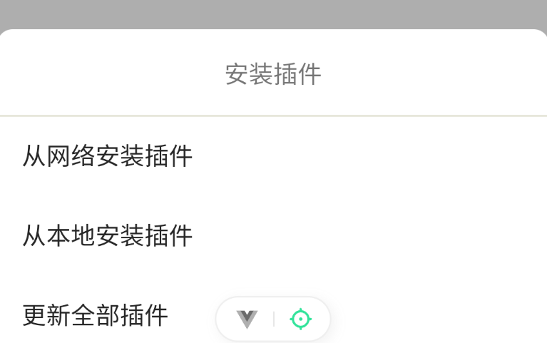
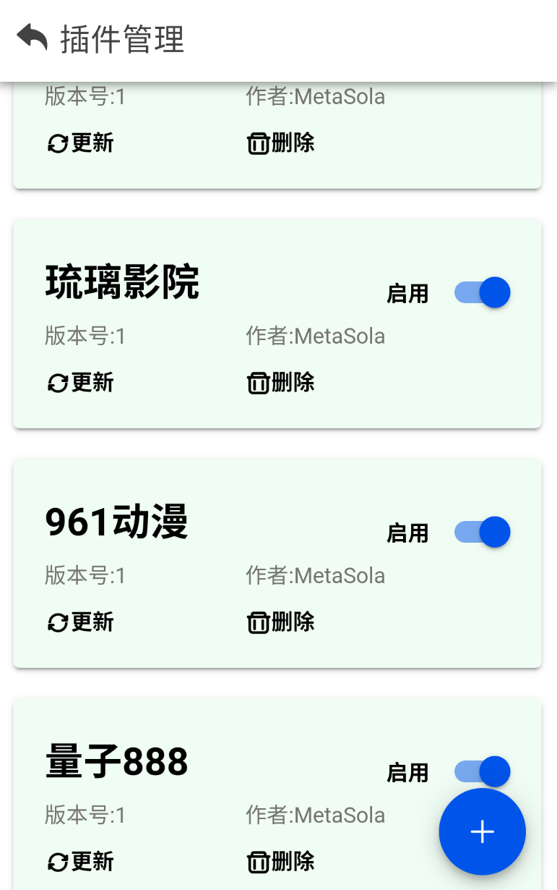

# 项目介绍

> 本项目由个人开发，纯粹用于个人学习与交流，非商业用途。请勿将其用于商业目的。若进行二次开发或使用，请注明项目出处。所有数据通过插件获取，且与本项目无关。

本项目利用插件机制，整合多个网络公开接口数据，实现免费视频播放功能。支持多种数据源、多条线路及不同类型的视频内容。

项目开源地址：[GitHub - FreeMovie](https://github.com/ss-sola/FreeMovie)

---

# 如何安装

- **项目唯一分发地址**：[下载 FreeMovie APK](https://blog.metasola.cn/freemovie/FreeMovie.apk)

- **插件试用地址**：[插件源地址](https://blog.metasola.cn/freemovie/source.json)

## 安装步骤

1. **下载安装 APK**：  
   下载并安装 APK 文件后，首次打开 **FreeMovie** 时，您会看到空白页面，这是正常现象。

   

2. **安装插件**：  
   点击右上角的图标，选择“插件管理”。接着点击右下角的 + 按钮，选择“从网络安装”，然后将插件地址粘贴到输入框中，点击“确认”按钮完成安装。

  

3. **启用插件**：  
   安装完成后，返回“插件管理”页面，您可以看到已安装的插件。点击“启用”按钮（默认已启用）。

4. **播放视频**：  
   完成安装后，您即可在应用内搜索并播放您喜欢的视频。

> 请注意，首页可能仍显示空白页面。这是由于页面缓存未刷新，您只需重启应用即可解决此问题。

## 插件说明

- 插件地址支持 **JSON** 和 **JS** 文件。
- 本地安装仅支持 **JS** 文件。

---

感谢您的使用！如果遇到问题或有任何建议，欢迎提交 issue 或反馈。
